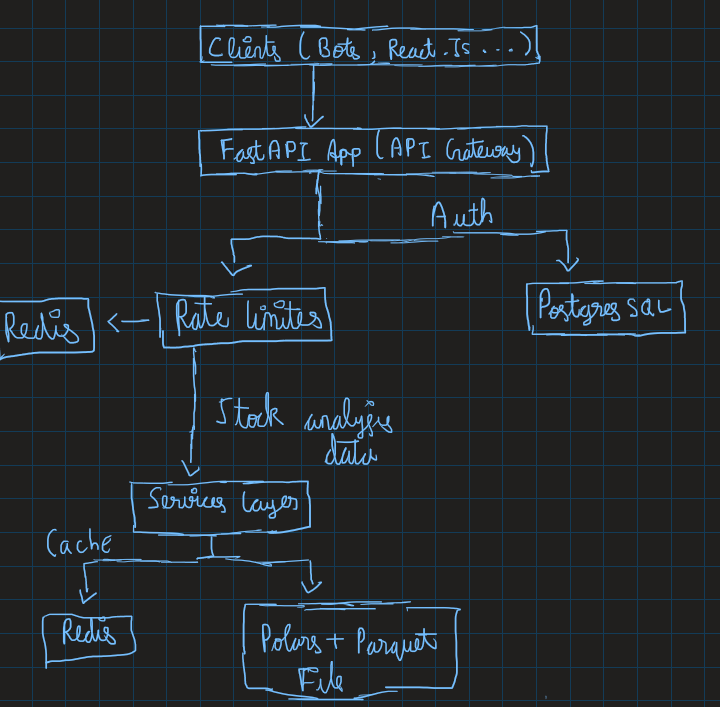

# 📄 Kalpi Technical Indicator API Assignment

## 💡Overview

This document describes the architecture, design decisions, scalability strategy, subscription model, and setup instructions for the Kalpi Technical Indicators API app. All of it is dockerized so it is just one single step to run the app

---

## 🎯 Goals

* High-performance stock indicator analytics.
* Support tier-based subscriptions (Free, Pro, Premium).
* Scalable and future-proof.
* Easy to set up with Docker.

---

## 🗺️ Architecture



---

## 💡 Design Justifications

### FastAPI

* Async by default, stateless. Hence scales with many concurrent clients.
* Auto-generates Swagger (OpenAPI) docs.

### Polars

* Written in RUST making it highly optimized and performant.
* Since Polars is written in RUST it can use all the cores of CPU without worrying about GIL lock imposed by the python interpreter for high throughput.
* Lazy execution optimizes filtering, rolling, and aggregations together on very large datasets.
* Used Polars vector operations everywhere instead of python loops so that RUST can take care performance intensive tasks

### Redis

* Ultra-fast for caching hot indicator queries.
* Used for distributed rate limiting per token.
* All the operations are atomic in nature.

### PostgreSQL

* Reliable transactional system for user and tier management.
* Supports advanced queries and relationships.

### Parquet data

* Efficient storage for historical OHLC data.
* Can handle billions of rows at low cost when stored in S3 or similar.

---

## 🚀 Scalability

### API Layer

* Stateless → can horizontally scale behind nginx.
* Multiple pods or containers using Kubernetes.
* Polars uses multi-threading and vectorized ops.

### PostgreSQL

* Can use read replicas for scale.
* Connection pooling via PgBouncer.

### Data Layer

* Store Parquet files on S3.

### Future scaling

* Precompute popular queries to reduce load(not a clever solution but works).

---

## 💳 Subscription Model

The subscription model provided in the ps was followed without any modifications.

### Enforced via

* `Authorization` header.
* Tier checks before indicator computation.
* Rate limits via Redis counters (reset daily).

---

## 🧪 Testing Approach

### Unit tests

* Individual indicator functions using mock DataFrames.

### Integration tests

* Spin up test Redis & Postgres.
* Check full flow: auth → request → caching → limits.

### Rate limit tests

* Simulate rapid calls, ensure counters increment & HTTP 429 returned on limit.

### Load tests

* Locust or K6 for concurrency simulation.
* Monitor CPU, Redis hit/miss, response times.

---

## ⚙️ Setup and Running Instructions (Docker)

### 1️⃣ Clone the repository

```bash
git clone https://github.com/yourusername/kalpi-indicator-api.git
cd kalpi-indicator-api
```

### 2️⃣ Create `.env` file

```env
DATABASE_URL=postgresql+psycopg2://admin:admin@db/kalpi_db
SECRET_KEY=12345678
```

### 3️⃣ Build and start containers

```bash
docker-compose up --build
```

### 4️⃣ API available at

```
http://localhost:8000
```

* Swagger UI: `/docs`
* ReDoc: `/redoc`

### 5️⃣ Create initial users and tokens

* Use `/signin` route to register.
* Use `/login` to obtain your token.
* Store token in header as `Authorization`.
* You can now query stock analysis data.

### 6️⃣ Example query

```bash
curl -X GET "http://localhost:8000/api/v1/indicators/RELIANCE?indicator_name=sma&start_date=2024-01-01&end_date=2024-04-01&window=20" \
  -H "Authorization: Bearer your_token_here"
```

---

## 💬 Final Notes

* 🎯 Fully horizontal scalable architecture.
* 💡 Smart caching and rate limiting.
* 💳 Subscription-ready design.
* ⚡ Ultra-fast analytics using Polars.
* 📈 Ready for production and growth.

---

🚀 For questions, contact:
* <a href="mailto:gurupranav08@gmail.com">
  
</a>

* <a href="https://www.linkedin.com/in/p-r-guru-pranav-20b32722a" target="_blank">
  
</a>

